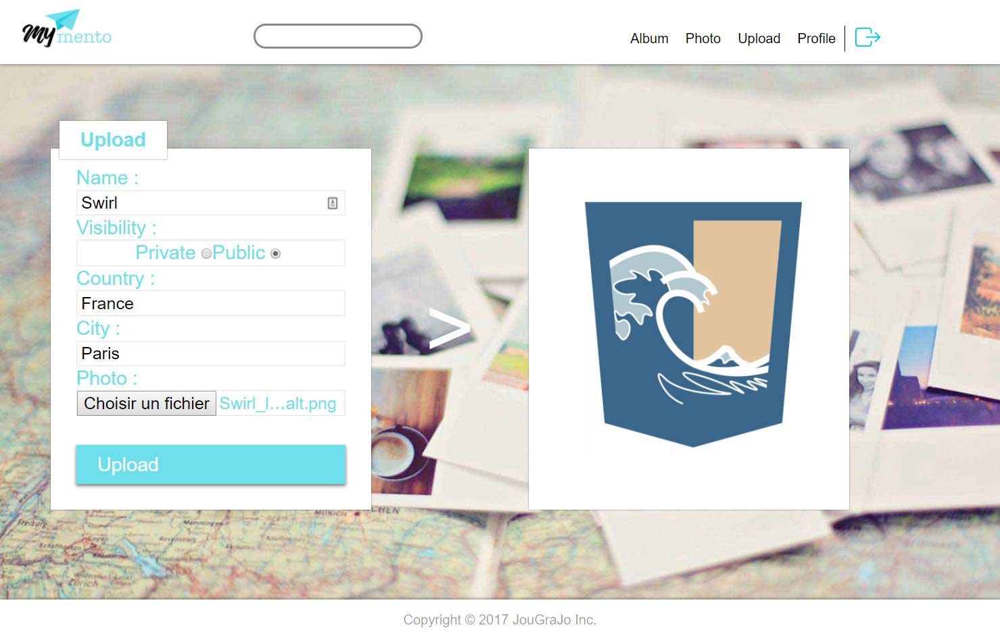
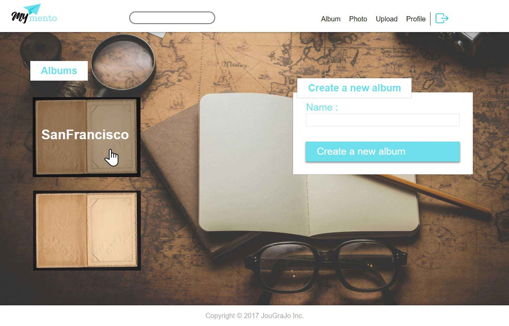

# Node React image sharing app ~ MyMento
Web project coded in Typescript.
Project done in collaboration with Quentin Gras <vhquentin@gmail.com>.

## Preview






## Technologies
* server : NodeJS, Express
* dev : Gulp, Nodemon
* database : MySQL
* front : React, HTML5/CSS3
* test : Mocha, Chai

## Usage
```
yarn install

yarn start

yarn test
```
If the configuration is not setup server side, it will exit at startup. Check class DBI **dbi.ts** for details.

## Misc
Database script: `/back/db/mymento.sql`

